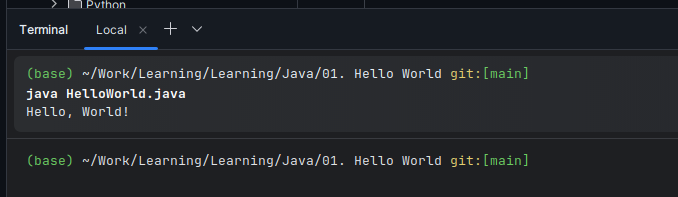
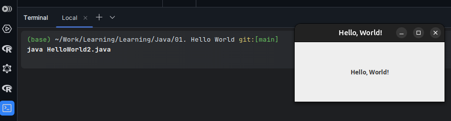

## Table of Contents

- [Description](#1-description)
- [Environment Setup](#2-environment-setup)

   - [Creating the Project](#21-creating-the-project)

- [How to Build and Run](#3-how-to-build-and-run)
- [Summary](#4-summary)

## 01. Java

### Simplest Hello, World!

#### 1. Description

The classic "Hello, World!" program is a fundamental starting point for beginners in programming. It is simple to create, build, debug, and run, providing a sense of accomplishment for new programmers. This chapter explores creating the "Hello, World!" program in both **Console** and **GUI** formats. All source code is included.

**NOTE:** The content of this chapter and the associated programs are subject to regular updates. Please remember to perform a `pull` or `fetch merge` before debugging and running the code.

#### 2. Environment Setup

Java can be executed on any platform that supports the Java Virtual Machine (JVM). For this exercise, the setup was performed on a Linux system using JDK 17, Git, GitHub, and IntelliJ Community Edition. The setup process is straightforward and applicable across various operating systems.

Requirements:
- Operating System (x64): Windows, Linux, or Mac.
- JDK 17 or higher.
- Git
- GitHub Account
- IntelliJ Community Edition

##### 2.1 Creating the Project

1. **Setup the Environment**: Install the JDK, Git, create a GitHub account, and install IntelliJ Community Edition with the necessary dependencies.

2. **Create a New Project**: Start a new project in IntelliJ.

3. **Create a New File**: In the project directory, create a file named `HelloWorld.java`.

4. **Write the Code**: Implement the following code to create the project class and main method:
   ```java
   // First Java program
   // Filename: HelloWorld.java
   public class HelloWorld {
       public static void main(String[] args) {
           System.out.println("Hello, World!");
       }
   }
   ```

5. **Expected Console Output**: Upon running, the console should display "Hello, World!".

   

6. **Create a GUI Version**: Extend the program to include a GUI version by adding the following code:
   ```java
   // Advancing the Console, Hello, World into a GUI app
   // Filename: HelloWorld2.java
   import javax.swing.*;

   public class HelloWorld {
       public static void main(String[] args) {
           // System.out.println("Hello, World!");
           JFrame frame = new JFrame("Hello, World!"); // Create a window frame with a title
           frame.setSize(300, 120); // Set the frame's size
           JLabel label = new JLabel("Hello, World!", JLabel.CENTER); // Create a centered label
           // Make the frame and label visible
           frame.add(label);
           frame.setVisible(true);
       }
   }
   ```

7. **Expected GUI Output**: The application should display a window with the message "Hello, World!" centered within it.

   

6. **Create a GUI Version**: Extend the program to include a GUI version by adding the following code:
   ```java
   // Advancing the Console, Hello, World into a GUI app
   // Filename: HelloWorld2.java
   import javax.swing.*;

   public class HelloWorld {
       public static void main(String[] args) {
           // System.out.println("Hello, World!");
           JFrame frame = new JFrame("Hello, World!"); // Create a window frame with a title
           frame.setSize(300, 120); // Set the frame's size
           JLabel label = new JLabel("Hello, World!", JLabel.CENTER); // Create a centered label
           // Make the frame and label visible
           frame.add(label);
           frame.setVisible(true);
       }
   }
   ```

7. **Expected GUI Output**: The application should display a window with the message "Hello, World!" centered within it.

### 3. How to Build and Run

1. Open a terminal in the directory containing `HelloWorld.java`.
2. Compile the project with the command: `$ javac HelloWorld.java`.
3. Run the compiled project with the command: `$ java HelloWorld`.

### 4. Summary

In this section, we introduced the basics of Java programming through the classic "Hello, World!" program. We set up the development environment, created a simple console application, and extended it to a GUI version. This exercise demonstrated the fundamentals of Java programming and provided a foundation for further learning.
